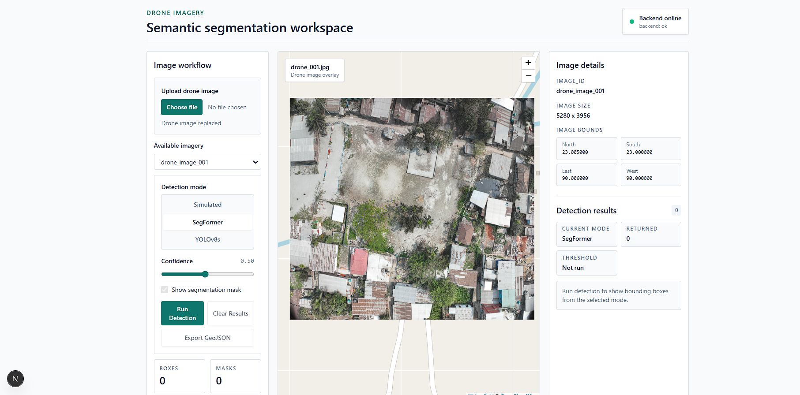
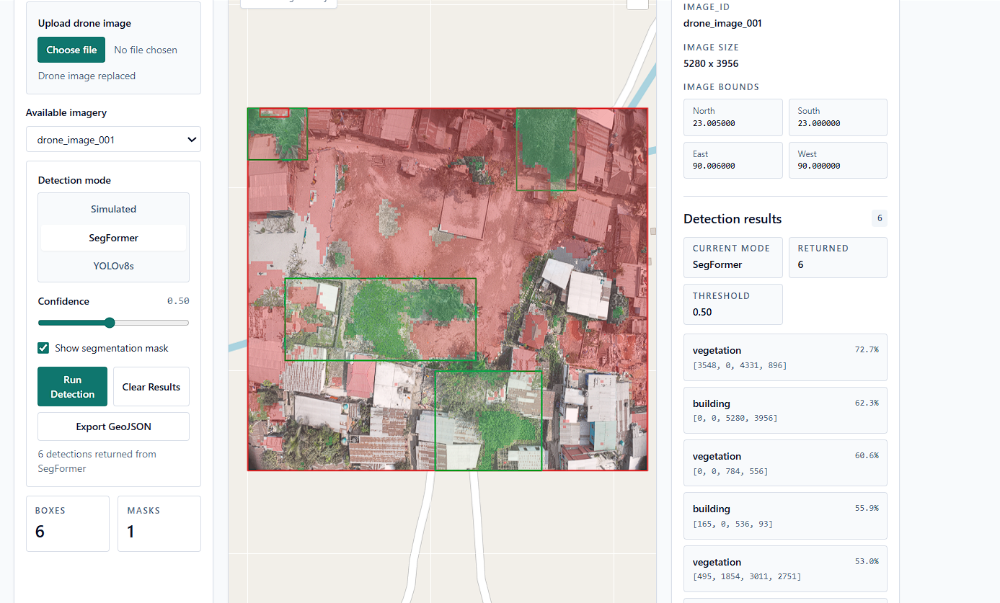
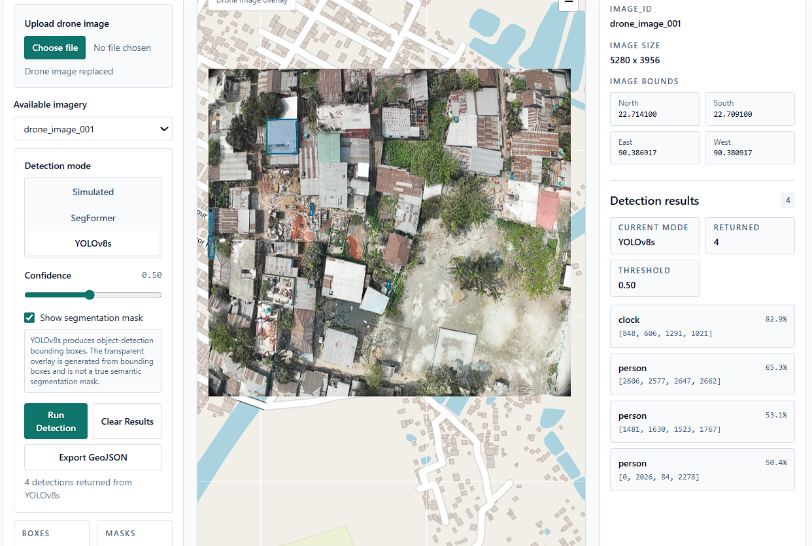
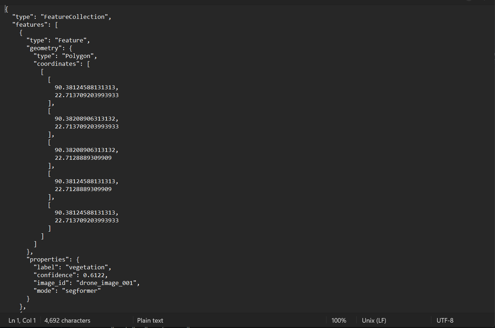
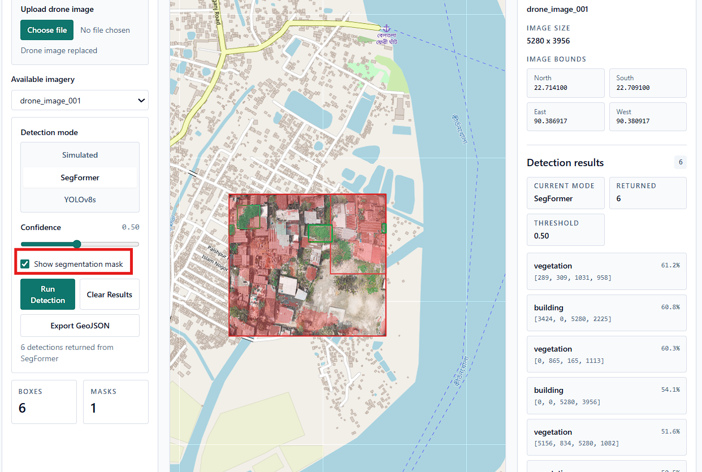

# Drone Imagery Semantic Segmentation Platform

## Project Overview

A full-stack drone imagery analysis workspace for viewing georeferenced raster imagery, running detection or segmentation inference, visualizing bounding boxes and transparent overlays, and exporting detection results as GeoJSON.

The app currently supports three detection modes:

- `Simulated`: deterministic demo detections for UI and API testing.
- `SegFormer`: semantic segmentation using HuggingFace SegFormer, converted into bounding boxes and a transparent segmentation mask.
- `YOLOv8s`: object detection using Ultralytics YOLOv8s with tiled inference, class filtering, and a bbox-derived transparent overlay.

## Tech Stack

- Frontend: Next.js 15 App Router, React 19, TypeScript, Tailwind CSS
- Mapping: Leaflet, React-Leaflet, OpenStreetMap tiles
- Backend: FastAPI, Python, Pydantic Settings, Uvicorn
- ML: Torch, Torchvision, HuggingFace Transformers, Ultralytics, Pillow, NumPy, OpenCV headless
- Models: `nvidia/segformer-b0-finetuned-ade-512-512`, `yolov8s.pt`
- Output formats: PNG overlays, frontend-generated GeoJSON FeatureCollections

## Architecture

```text
frontend/
  app/
    layout.tsx              Next.js root layout
    page.tsx                Dashboard entry page
    globals.css             Tailwind and Leaflet global CSS
  components/
    Dashboard.tsx           Main UI and workflow state
    MapViewport.tsx         Compatibility wrapper
    map/
      DroneMap.tsx          Client-only Leaflet MapContainer
      RasterOverlay.tsx     Drone image ImageOverlay
      MaskOverlay.tsx       SegFormer mask / YOLO overlay ImageOverlay
      DetectionBoxes.tsx    Bbox rectangles and popup labels
      FitBounds.tsx         Leaflet fitBounds hook component
  lib/
    api.ts                  Typed API client helpers
    geojson.ts              Frontend-only GeoJSON export

backend/
  app/
    api/routes/
      health.py
      images.py
      detect.py
    schemas/
      detection.py
      images.py
      health.py
    services/
      image_registry.py
      simulated_detection.py
      segformer_detection.py
      yolo_service.py
      bbox_utils.py
      overlay_utils.py
    main.py
  static/
    images/
    masks/

model/
  segformer_service.py      SegFormer loading, inference, mask extraction
```

The frontend calls the FastAPI backend through `frontend/lib/api.ts`. Registered image metadata drives the Leaflet raster bounds. Detection responses return pixel-space bounding boxes in the original image coordinate system, and the frontend converts them to geographic Leaflet rectangles and GeoJSON polygons.

Leaflet is loaded client-side using dynamic import (`ssr:false`) to prevent hydration issues. Leaflet CSS is imported globally from `frontend/app/globals.css`, while all React-Leaflet rendering lives in client-only components under `frontend/components/map/`.

## Features

- Backend health, image registry, upload, and detection endpoints.
- One local demo image record: `drone_image_001`.
- Replacement image upload through `POST /api/images`.
- Uploaded images with EXIF GPS latitude/longitude are centered on that map location.
- Detection mode selector for `Simulated`, `SegFormer`, and `YOLOv8s`.
- Confidence threshold slider from `0.10` to `0.95`.
- Optional transparent overlay toggle.
- Leaflet map with OSM base layer, georeferenced drone raster, mask overlay, and bbox rectangles.
- Detection results panel with mode, count, threshold, labels, confidence, and pixel bbox values.
- Empty and error states for model/backend failures.
- Frontend-only GeoJSON export as `detections_<image_id>.geojson`.

## Setup Instructions

### Backend

```bash
cd backend
python -m venv .venv
.venv\Scripts\activate
pip install -r requirements.txt
uvicorn app.main:app --reload --host 127.0.0.1 --port 8000
```

Backend URLs:

```text
GET  http://localhost:8000/
GET  http://localhost:8000/health
GET  http://localhost:8000/api/images
POST http://localhost:8000/api/images
POST http://localhost:8000/api/detect
GET  http://localhost:8000/docs
```

Use `localhost` or `127.0.0.1` in the browser. `0.0.0.0` is only a bind address for the server.

### Frontend

```bash
cd frontend
npm install
npm run dev
```

Frontend URL:

```text
http://localhost:3000
```

If port `3000` is already busy, Next.js may run on another port such as `3001`. Add that origin to backend CORS settings if needed.

## Environment

Create `frontend/.env.local` if the backend URL is different:

```env
NEXT_PUBLIC_API_BASE_URL=http://localhost:8000
```

Create `backend/.env` to override backend settings:

```env
APP_NAME=Drone Imagery Segmentation API
BACKEND_CORS_ORIGINS=http://localhost:3000,http://localhost:3001,http://127.0.0.1:3000,http://127.0.0.1:3001
```

## API Endpoints

### Health

```http
GET /health
```

```json
{
  "status": "ok",
  "service": "backend"
}
```

### List Images

```http
GET /api/images
```

```json
{
  "images": [
    {
      "image_id": "drone_image_001",
      "filename": "drone_001.jpg",
      "image_url": "http://localhost:8000/static/images/drone_001.jpg",
      "width": 2048,
      "height": 1536,
      "bounds": {
        "north": 23.005,
        "south": 23.0,
        "east": 90.006,
        "west": 90.0
      }
    }
  ]
}
```

### Upload Replacement Image

```http
POST /api/images
Content-Type: multipart/form-data
```

The uploaded image replaces the local demo image and keeps the same image ID, `drone_image_001`.

If the uploaded image contains EXIF GPS latitude and longitude, the backend recenters the image bounds around that GPS location. If GPS metadata is missing, the previous bounds are kept.

### Get Image By ID

```http
GET /api/images/{image_id}
```

Unknown image IDs return `404`.

### Run Detection

```http
POST /api/detect
```

```json
{
  "image_id": "drone_image_001",
  "mode": "segformer",
  "confidence_threshold": 0.5
}
```

Supported modes:

- `simulated`
- `segformer`
- `real` legacy alias for SegFormer
- `yolo`

Response shape:

```json
{
  "image_id": "drone_image_001",
  "mode": "segformer",
  "detections": [
    {
      "label": "building",
      "confidence": 0.87,
      "bbox": [0, 0, 128, 128]
    }
  ],
  "mask_url": "http://localhost:8000/static/masks/drone_image_001_mask_0_50_<uuid>.png"
}
```

`mask_url` is `null` for simulated detection. SegFormer returns a true transparent segmentation mask. YOLOv8s returns a transparent bbox-derived overlay for visual comparison.

## Model Integration

### SegFormer

SegFormer integration lives in `model/segformer_service.py` and is wrapped by `backend/app/services/segformer_detection.py`.

- Loads `nvidia/segformer-b0-finetuned-ade-512-512` lazily on first request.
- Uses CUDA when available and CPU otherwise.
- Runs semantic segmentation with HuggingFace Transformers and Torch.
- Maps useful ADE classes into labels such as `building`, `vegetation`, `road`, and `earth/ground`.
- Extracts contours with OpenCV and converts segmentation regions into pixel bboxes.
- Generates a transparent RGBA semantic mask PNG.
- Saves generated masks under `backend/static/masks/`.
- Returns original-image pixel coordinates for frontend map alignment.

### YOLOv8s

YOLOv8s integration lives in `backend/app/services/yolo_service.py`.

- Loads `yolov8s.pt` lazily through Ultralytics.
- Uses tiled inference with `1024` pixel tiles and `20%` overlap.
- Uses `imgsz=1024`, `iou=0.45`, `max_det=300`, and CUDA when available.
- Projects tile detections back into original image pixel coordinates.
- Applies NMS through shared bbox utilities.
- Filters common misleading COCO false positives in aerial imagery, including `bench`, `potted plant`, and furniture-like classes.
- Generates a transparent PNG overlay from detection bboxes under `backend/static/masks/overlays/`.

YOLOv8s is an object detector, not a semantic segmentation model. Its overlay is generated from bounding boxes and is not a true segmentation mask.

## Screenshots

### Dashboard Map



### SegFormer Results



### YOLOv8s Results



### GeoJSON Export



### Mask Overlay Toggle



## Limitations

- Only one image record is currently registered: `drone_image_001`.
- Uploaded images replace the demo image instead of creating persistent records.
- Uploaded image geospatial bounds are centered from EXIF GPS when available. Exact corner alignment still requires real image footprint metadata, such as GeoTIFF bounds, a world file, or manually provided corner coordinates.
- Generated mask and overlay PNG cleanup is not implemented.
- No database, authentication, result history, or automated test suite yet.
- SegFormer uses ADE classes, so label coverage depends on the pretrained model vocabulary.
- YOLOv8s is trained on COCO and cannot reliably detect drone land-cover classes that are not COCO objects, such as `river`, `open_field`, or generalized `vegetation`.
- CPU inference can be slow, especially for first model load and YOLO tiled inference.

## Troubleshooting

### Leaflet Not Loading

- Confirm the map is imported dynamically with `ssr:false` from `Dashboard.tsx`.
- Confirm `frontend/app/globals.css` includes `@import "leaflet/dist/leaflet.css";`.
- Restart the frontend dev server after dependency or CSS changes.
- If you see hydration warnings caused by browser extensions injecting attributes into `<html>` or `<body>`, test in an incognito window with extensions disabled. The app also suppresses root hydration warnings for this case.

### Uploaded Image Not Moving To GPS Location

- Confirm the uploaded image has EXIF GPS latitude and longitude metadata.
- Some image editors or messaging apps strip EXIF metadata before upload.
- Latitude and longitude place the image center. To align image corners exactly with roads/buildings, provide true geospatial bounds from a GeoTIFF, world file, orthomosaic export, or manual corner coordinates.

### CORS Errors

- Make sure the backend is running on `http://localhost:8000`.
- Make sure `NEXT_PUBLIC_API_BASE_URL` matches the backend URL.
- Add your frontend origin to `BACKEND_CORS_ORIGINS`, especially if Next.js starts on `3001`.
- Restart the backend after editing `.env`.

### Torch Or Model Loading Issues

- Install backend dependencies from `backend/requirements.txt` inside the active virtual environment.
- The first SegFormer run may download HuggingFace files into `model/.cache/huggingface`.
- The first YOLOv8s run may download `yolov8s.pt` unless it already exists locally.
- If CUDA packages are unavailable, the services should fall back to CPU.
- For network-restricted environments, pre-download model weights and caches before running the demo.

### Slow CPU Inference

- First inference is slower because the model is loaded lazily.
- YOLO tiled inference is slower than single-image inference because it improves small-object coverage.
- Use a CUDA-capable environment for faster model inference.
- Lowering image size or reducing tile work can improve speed, but may reduce detection quality.

## Future Improvements

- Store multiple uploaded image records with per-image metadata.
- Add configurable or user-provided geospatial bounds for uploads.
- Add cleanup or retention policy for generated mask and overlay PNGs.
- Add automated backend and frontend tests.
- Add persisted result history and downloadable backend-side exports.
- Add a database and authentication.
- Fine-tune a segmentation or detection model on drone imagery labels such as `building`, `river`, `road`, `open_field`, and `vegetation`.
- Add model configuration through environment variables.
- Add production deployment settings for static files, model cache paths, and CORS.

## Verification

Recent checks:

```bash
cd backend
.venv\Scripts\python.exe -m compileall app ..\model
```

```bash
cd frontend
.\node_modules\.bin\tsc.cmd --noEmit --incremental false
npm.cmd run build
```

Manual runtime checks have verified:

- `GET /health`
- `GET /api/images`
- Simulated detection with `mask_url: null`
- SegFormer detection with generated static PNG mask
- YOLOv8s tiled detection with original-image bbox coordinates and generated bbox overlay URL
- Frontend map rendering, bbox overlay, mask toggle, mode selector, and GeoJSON export
